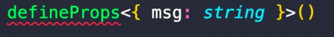

##_对 eslint、prettier、husky、commitlint、lint-staged、commitizen 规范使用的总结_

####主要使用技术

- eslint： JavaScript 代码检查工具
- prettier： 代码格式化工具
- husky： Git hooks 工具
- commitlint：代码提交的检查
- lint-staged：检测文件插件
- commitizen：代码提交内容标准化

## 1. eslint（Js 编码规范，检测并提示错误或警告信息）

```
npm i eslint -D
npx eslint --init
```

生成.eslintrc 文件 用于配置 eslint 插件

> PS：在 env 中需要添加`node: true`否则 module.exports 会有报错

> 
> env中需配置'vue/setup-compiler-macros': true

> eslint-plugin-vue 它提供了 parser 和 rules。parser 为 vue-eslint-parser，rules 为 [rules 配置地址](https://eslint.vuejs.org/rules/)。

## 2. prettier（代码风格管理，更好的代码风格效果）

```
  npm i prettier eslint-config-prettier eslint-plugin-prettier eslint-plugin-vue -D
```

1. eslint-plugin-vue 插件

   - vue.js 官方的 Eslint 插件（用于查找 vue 语法的错误以及不合规则的写法）

2. eslint-plugin-prettier

   - 使 prettier 规则优先级更高，Eslint 优先级低

3. eslint-config-prettier
   - 让 prettier 和 eslint 中的冲突失效，并以 prettier 的规则为优先

> 需要在.eslintrc 文件的 extends 中添加`"prettier"`则可以避免冲突

## 3. Git 的提交规范

| 使用工具    | 作用                                                                   |
| ----------- | ---------------------------------------------------------------------- |
| husky       | 对 git 执行的一些命令，通过对应的 hooks 钩子触发，执行自定义的脚本程序 |
| lint-staged | 只检测 git add . 中暂存区的文件，对过滤出的文件执行脚本                |
| commitlint  | 检测 git commit 内容是否符合定义的规范                                 |
| commitizen  | 提示定义标准化的 git commit                                            |

- 安装 husky、lint-staged

```
npm i lint-staged husky -D
npm set-script prepare "husky install" // 在package.json中添加脚本
npm run prepare // 初始化husky
```

初始化 husky 之后会在当前目录生成.husky 文件夹
`yarn husky add .husky/pre-commit "npx lint-staged"`在.husky 文件夹下生成文件 pre-commit
该文件会在`git commit`执行之前执行其中的脚本（可以使用 `git commit --no verify` 命令绕过该钩子）

然后在根目录下创建.lintstagedrc.json 进行对文件的检查

- 安装 commitlint、@commitlint/config-conventional

```
npm i commitlint @commitlint/config-conventional cz-conventional-changelog -D
yarn husky add .husky/commit-msg 'npx --no-install commitlint --edit "$1"'
```

- @commitlint/config-conventional 这是一个规范配置,标识采用什么规范来执行消息校验, 这个默认是 Angular 的提交规范

* `cz-conventional-changelog` changelog 的适配器
  - 在 package.json 中添加
  ```JavaScript
  "config": {
    "commitizen": {
      "path": "./node_modules/cz-conventional-changelog"
    }
  },
  ```
  - 然后在根目录添加 commitlint.config.js
